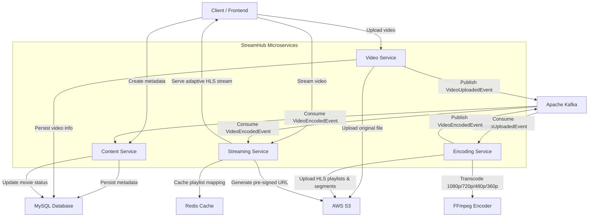

# StreamHub

StreamHub is a cloud-native, distributed video streaming platform built using a Spring Boot microservices architecture. It allows users to upload videos, which are automatically transcoded into multiple HLS resolutions using FFmpeg, stored on AWS S3, and streamed back to clients through secure, pre-signed URLs with adaptive bitrate playback.

The system is designed around event-driven communication, using Kafka to decouple upload, encoding, and streaming workflows, and Redis to cache playlist mappings for low-latency playback.

## Features

- Distributed microservices architecture with independently deployable services
- Event-driven communication between services using Apache Kafka
- Adaptive HLS video streaming with multiple bitrate variants
- Multi-resolution video encoding: 1080p, 720p, 480p, and 360p
- Cloud-native storage of original and encoded media on AWS S3
- Redis caching for playlist and segment lookups
- Secure video access via S3 pre-signed URLs
- Asynchronous, non-blocking processing pipeline for encoding jobs
- REST APIs for metadata management, upload, and streaming
- Fully containerized infrastructure using Docker Compose

## Architecture

StreamHub is composed of four core services, each with a single responsibility, communicating asynchronously through Kafka and sharing state through MySQL, Redis, and S3.



## Project Workflow

1. User creates movie metadata through the Content Service.
2. User uploads the video file through the Video Service.
3. Video Service stores the original video on AWS S3.
4. Video Service publishes a `VideoUploadedEvent` to Kafka.
5. Encoding Service consumes the event and begins processing.
6. FFmpeg transcodes the original video into 1080p, 720p, 480p, and 360p HLS streams.
7. Encoded playlists (`.m3u8`) and segments (`.ts`) are uploaded to AWS S3.
8. Encoding Service publishes a `VideoEncodedEvent` to Kafka.
9. Streaming Service consumes the event and stores the playlist mapping in Redis.
10. Content Service consumes the same event and updates the movie's status to ready.
11. User requests the stream, and the Streaming Service returns a pre-signed URL for adaptive HLS playback.

## Technology Stack

| Category            | Technology                          |
|---------------------|--------------------------------------|
| Language             | Java 21                              |
| Framework            | Spring Boot                          |
| Persistence          | Spring Data JPA, MySQL               |
| Messaging            | Apache Kafka                         |
| Caching              | Redis                                |
| Object Storage       | AWS S3                               |
| Video Processing     | FFmpeg                               |
| Streaming Protocol   | HLS (HTTP Live Streaming)            |
| Containerization     | Docker, Docker Compose               |
| Build Tool           | Maven                                |

## Project Structure

```
streamhub/
├── content-service/        # Manages movie metadata and status
├── video-service/          # Handles video upload and S3 storage
├── encoding-service/       # Consumes upload events, runs FFmpeg, produces HLS output
├── streaming-service/      # Serves adaptive streams via pre-signed URLs
├── docker-compose.yml       # Local orchestration for all services and infra
└── README.md
```

## API Overview

### Content Service
- `POST /api/movies` — create movie metadata
- `GET /api/movies/{id}` — fetch movie details and status

### Video Service
- `POST /api/videos/upload` — upload a video file linked to a movie ID
- `GET /api/videos/{id}/status` — check upload/processing status

### Streaming Service
- `GET /api/stream/{movieId}` — retrieve a pre-signed HLS playlist URL for adaptive playback

> Note: Exact request/response payloads and additional endpoints are documented within each service's own README/controller layer.

## Getting Started

### Prerequisites

- Java 21
- Maven 3.9+
- Docker and Docker Compose
- FFmpeg installed on the encoding host (or available inside the encoding-service container)
- AWS account with an S3 bucket and IAM credentials

### Clone the Repository

```bash
git clone https://github.com/Varunsingh7389/streamhub.git
cd streamhub
```

### Configure Environment

Set the required environment variables (AWS credentials, S3 bucket name, MySQL credentials, Kafka broker address) in each service's `application.yml` or via a `.env` file consumed by Docker Compose.

### Run Infrastructure with Docker

```bash
docker-compose up -d
```

This starts MySQL, Kafka, Zookeeper, and Redis.

### Run the Services

Each service can be built and run independently:

```bash
cd content-service
mvn clean install
mvn spring-boot:run
```

Repeat for `video-service`, `encoding-service`, and `streaming-service`.

### How to Upload a Video

1. Create movie metadata via the Content Service API.
2. Upload the video file via the Video Service API, referencing the movie ID.
3. The Encoding Service will automatically pick up the upload event and begin transcoding.

### How to Stream a Video

1. Open the StreamHub frontend.
2. Enter the Movie ID.
3. The frontend requests a pre-signed streaming URL from the Streaming Service and plays the adaptive HLS stream.

## Screenshots


## Author

**GitHub:** [Varunsingh7389](https://github.com/Varunsingh7389/streamhub)
**LinkedIn:** [varun1103](https://www.linkedin.com/in/varun1103/)
